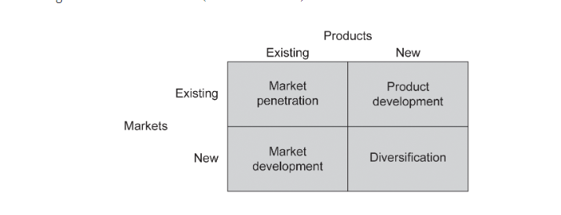
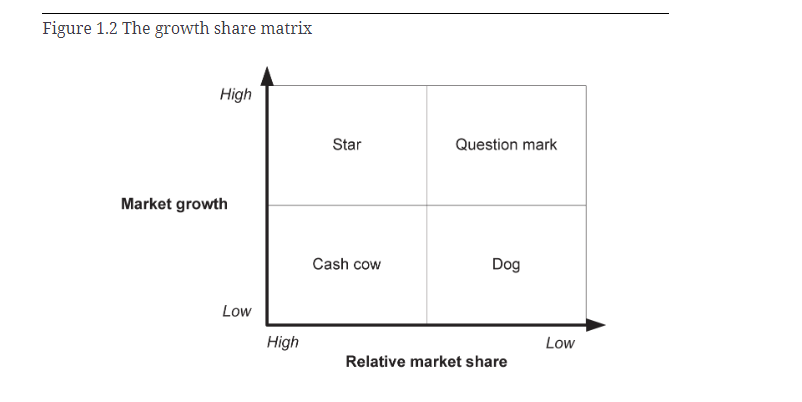
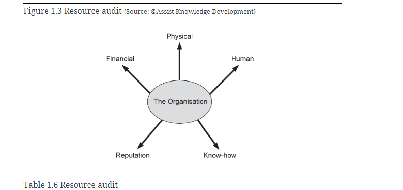

# Strategic Context

## External Environment Analysis

### PESTLE analysis

Gathering the opinions of specialists in their respective fields. PESTLE identifies 
external factors that could affect the business.

PESTLE
Political - Change of government etc
Economic - eg Britain leaving the EU
Socio-cultural - For example, the preference for flexible and home working
affecting how you recruit talent
Technological - Example being generative AI recently
Legal - Including laws from countries that the organisation does not work in but might affect,
eg GDPR in Europe
Environmental - Concerns about the environment, green tech or sustainability

A PESTLE analysis DOES NOT involve actually thinking about solving the problem, just whether or not
it will affect the organisation and what impact it might have currently

### Porter's five forces analysis

Different focus from PESTLE, it instead examines competition with the business domain or industry within which an organisation operates and identifies the business pressures that it may face.

Porter's Five Forces are:
Industry Competitors - What is the level of competition for the products or services in this industry? Is the organisation 
in a good competitive position or is it a minor player? Are there several competitors that hold the power in the industry?
Potential Entrants - Are there barriers to entry? How likely are new startups?
Substitutes - How wide is the range of substitutes? 
Buyers - How much choice do buyers have? Can they switch suppliers easily? Do they have power in the relationship 
or are they locked into the supplier?
Suppliers - How many suppliers are available?

## Internal environment analysis

### Ansoff's Matrix

Four quadrants are created:

Market penetration: This situation is where existing markets are targeted for greater penetration by existing products. In
this approach, organisations decide to continue with their existing products and markets but to adopt tactics such as 
additional promotion, increased sales efforts or revised pricing approaches in order to generate increased market share.

Market development: In this situation the organisation adopts a strategy of exploring other markets for its products. This 
may mean targetting new markets in other countries or applying the products to different markets within the existing geographical 
areas of operation.

Product development: This strategy involves developing new products or services, and targetting existing markets. Another approach to it
would be to add further, related features to existing products and services.

Diversification: The most radical strategic alternative is to develop new products or services and target new markets. This is a risky 
strategy to adopt since it does not use existing expertise or leverage the current customer base.

### Growth Share Matrix

The Growth Share Matrix is used to assess an organisation's products and services according to their relative market shares (relative to the third ranked player) and their market growth prospects.

Note: When a product has been identified as a 'dog' it may be time to remove it from the portfolio, as even limited investment might be a waste of finance.

Here are the four quadrants of the Growth Share Matrix:

Star - These are high-growth business units, products or services with a high percentage of market share. Over time, the market growth will slow down for these products and, if they maintain their relative market share, they will become 'cash cows'.
Cash cow - These are low-growth business units, products or services that have a relatively high market share. They are mature, successfult products that can be sustained without large investment. They generate the income required to develop the new products (or revise the problematic products) that will hopefully become 'stars' in the portfolio.
Question mark - These are business units, products or services with low market share but operating in high-growth markets. They have potential but may require substantial investment in order to develop their market share, typically at the expense of more powerful competitors. Management has to decide which 'question marks' to invest in, and which ones will be allowed to fail.
Dog - These are business units, products or services that have low relative share and are in unattractive, low-growth markets. Dogs may generate enough cash to break even, but they do not have good prospects for growth, and so are rarely, if ever, worth investing in.

### Resource Audit

A resource audit is used to analyse key areas of internal capability in order to identify the resources that enable business operations and change, and those that may undermine or prevent such efforts. 

There are five categories in the resource audit:
Financial - The financial resources available, which may be the organisation's financial assets but could include the possibility of loans or credit. The organisation's financial stability, and whether it has access to funds for investment and development, should be considered.

Physical - The land, buildings and equipment available for use by the organisation, whether owned or leased

Human - The people employed by the organisation, whether on a permanent or a temporary basis

Reputation - The marketplace perception of the organisation and the amount of goodwill or, alternatively, antipathy generated by this reputation.

Know-how - The information held within the organisation, and the way it is stored and used to support the organisation's work.

### VMOST analysis

## Strategy analysis

### Business model canvas

### Cultural web

### Business capability model

### Information concepts model 

### SWOT analysis

## Performance measurement

### Balanced scorecard

### Critical success factors

### Key performance indicators