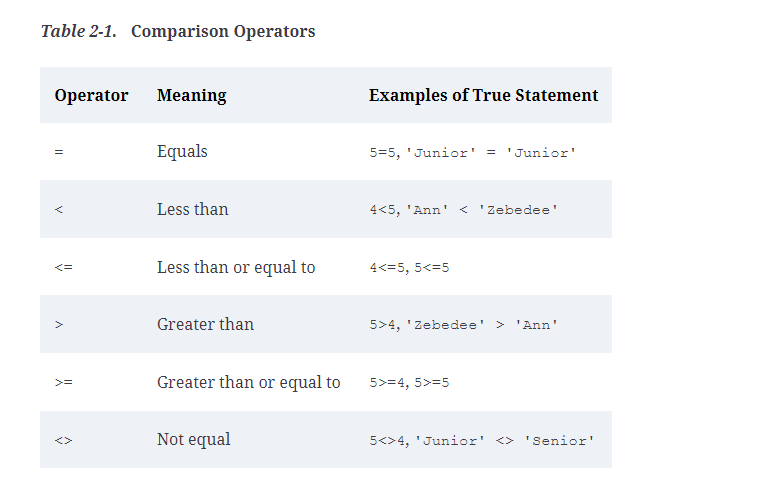
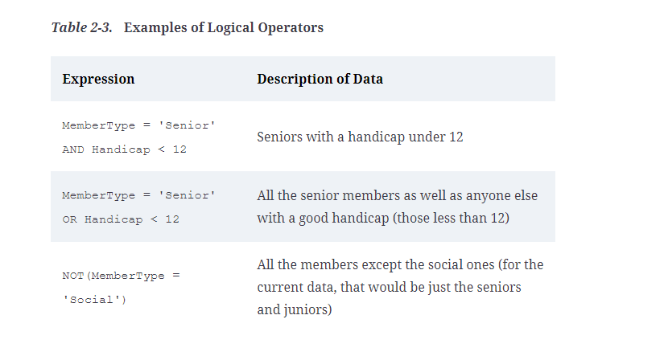

# Basic SQL queries

* Means all columns

## Retrieve all columns from the employees table
```SQL
SELECT * FROM employees;
```

## Select distinct columns from the employees table
```SQL
SELECT DISTINCT department FROM employees;
```

## Filter based on specified conditons
```SQL
SELECT * FROM employees WHERE salary > 55000.00;
```

# Using aliases 

Here we have a query which further specifies the tablename with dot notation.
This is useful in cases where multiple tables might be involved in a query and 
you want to be extra specific

```SQL
SELECT Member.LastName, Member.FirstName, Member.Phone
FROM Member
WHERE Member.MemberType = 'Senior'
```

Here is an example of using an alias where we substitute the table Member
for the letter m
```SQL
SELECT m.LastName, m.FirstName, m.Phone
FROM Member m
WHERE m.MemberType = 'Senior'
```

# Saving queries as views

Views create virtual (temporary) databases from permanent ones using this
syntax:

```SQL
CREATE VIEW PhoneList AS
SELECT m.LastName, m.FirstName, m.Phone
FROM Member m
```

You can then call on that virtual database like so:

```SQL
SELECT * FROM PhoneList
```

## Comparison operators in SQL



# UPPER function

Converts text to uppercase, good for db systems that don't match on different cases

```SQL
SELECT *
FROM Member m
WHERE UPPER(m.MemberType) = 'JUNIOR'
```

# Logical operators



# IS NULL

When you want to find something that is null, use this syntax:

```SQL
SELECT *
FROM Member m
WHERE m.Gender IS NULL

SELECT *
FROM Member m
WHERE NOT (m.Handicap IS NULL)
```

Nulls are dealt with in the following way on a truth table:


Something has to return true to be retrieved in an SQL query.

## DISTINCT keyword

DISTINCT returns only the values that are distinct, like so:

```SQL
SELECT DISTINCT m.MemberType
FROM Member m
```

## ORDER BY and ORDER BY DESC

ORDER BY keywords allow you to order retrieved data

```SQL
SELECT *
FROM Member m
WHERE m.MemberType = 'Senior'
ORDER BY m.LastName, m.FirstName
```

Here's how to do descending:
```SQL
SELECT m.Lastname, m.FirstName, m.Handicap
FROM Member m
ORDER BY m.Handicap DESC
```

And here's how to put nulls at the bottom with a CASE statment:

```SQL
SELECT m.LastName, m.FirstName, m.Handicap
FROM Member m
ORDER BY (CASE
             WHEN m.Handicap IS NULL THEN 1
             ELSE 0
          END), m.Handicap
```

## COUNT

You can use the COUNT function to get the amount of a certain criteria that exists, for example:

```SQL
SELECT COUNT(*) FROM Member
```

```SQL
SELECT COUNT(*) FROM Member m
WHERE m.MemberType = 'Senior'
```

```SQL
SELECT COUNT(DISTINCT MemberType) FROM Member
```


## Things to remember

The WHERE clause considers only one row at a time. Don't use it for queries that require you to look at several rows at once, as in who entered both tournaments or who did not enter a tournament
