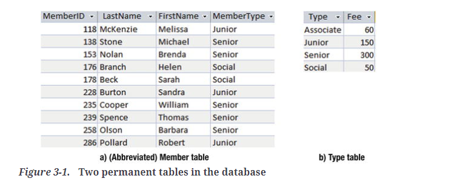
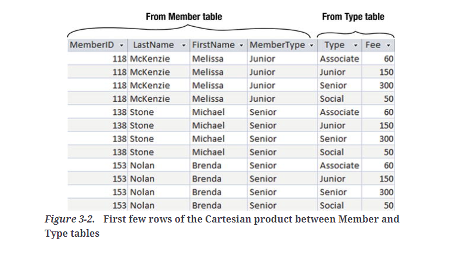
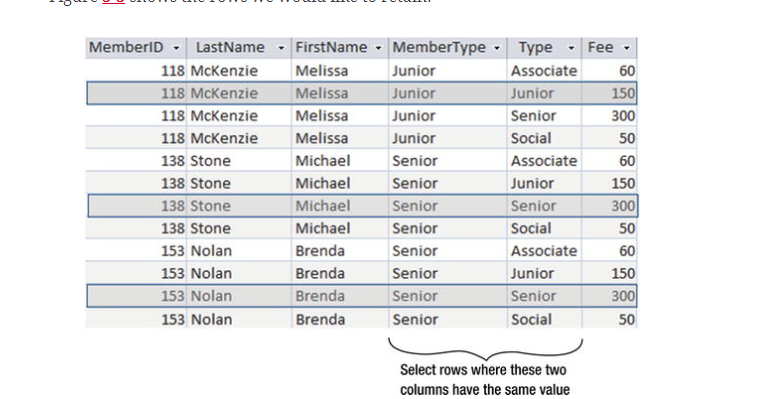
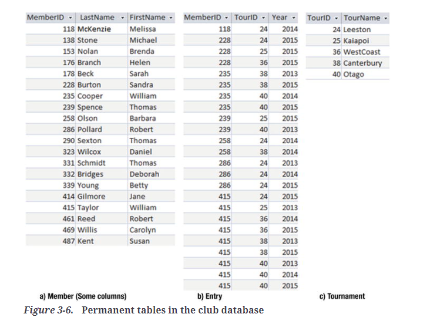

# Joins

Joins allow you to combine data from two different tables.

## Cross joins

Cross joins retrieve the Cartesian Product of two different tables. 

Here are two tables we want to cross join:



And here is what the start of the cartesian product of that cross join looks like:



You can see each of the rows from the Member table has been multiplied by the rows of the Type table

This is done using this command:

```SQL
SELECT *
From Member m CROSS JOIN Type t;
```

However, alot of this information in the cross-joined table is meaningless, so we move on to Inner Joins

## Inner Joins

If you wanted only the useful information, like that highlighted:



you would use the following SQL query:

```SQL
SELECT *
FROM Member m INNER JOIN Type t ON m.MemberType = t.Type;
```
Note: In order to compare two columns (like the above MemberType and Type), you must make sure they are join compatible.
This usually means they are represented by the same data type, but also means logically you would need to check they 
might contain the same values. You also may run into problems if one field is CHAR(10) and another is CHAR(15) etc.

## Outcome approach to Joins

The following is the same as the previous SQL above, but done in an outcome approach as opposed to a process approach

```SQL
SELECT *
FROM Member m, Type t
WHERE m.MemberType = t.Type;
```

## Extending Join Queries

Because the result of a join is another table, we can then join that result to a third table (and so on).

Here are some tables we will use to extend join queries:



Here are two ways of finding everyone who entered the Leeston tournament in 2014:

### Process Approach

```SQL
SELECT *
FROM (Member m INNER JOIN Entry e ON m.MemberID = e.MemberID)
    INNER JOIN Tournament t ON e.TourID = t.TourID
WHERE TourName = 'Leeston'
AND Year = 2014;
```

Order of operations does not matter in SQL, it is sent to the engine of whatever database program you are using,
and the query will be optimised. You can make things more efficient by providing indexes for your tables (later subject).

### Outcome Approach

```SQL
SELECT m.LastName, m.FirstName
FROM Member m, Entry e, Tournament t
WHERE m.MemberID = e.MemberID
    AND e.TourID = t.TourID
    AND t.TourName = 'Leeston' AND e.Year = 2014;
```

## Other Types of Joins

The previous joins have all been equi-joins. An equi-join is one where the join condition has an equals operator. You can have other types of join, but ultimately a join is just a Cartesian product followed by selecting a subset of rows, and the select condition can consist of different comparison operators such as <> or >.

## Natural Joins

A natural join assumes that you will be joining on columns that have the same name in both tables. The join condition is that the values in the two columns with the same name are equal, and one of these columns will be removed from the result. For example:

```SQL
SELECT * FROM
Member NATURAL JOIN Entry;
```

would produce the same output as:

```SQL
SELECT * FROM
Member m INNER JOIN Entry m on m.MemberID = e.MemberID;
```

The only difference would be only one of the MemberID columns would be returned in the natural join.


