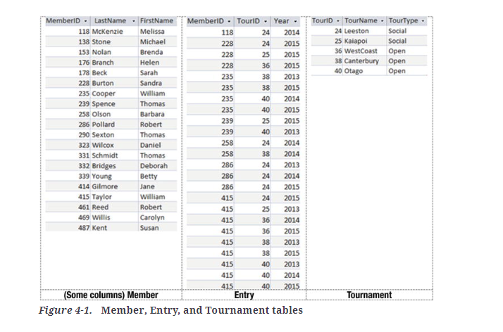
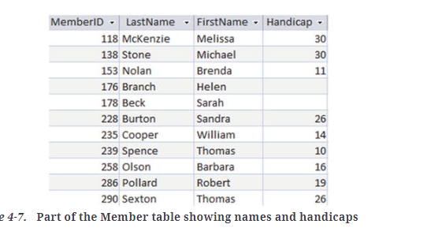

# Subqueries

Subqueries represent queries within other queries

## IN Keyword

The IN keyword alows us to select rows from a table, where the condition allows an attribute to have one of several values.
For example, if we wanted to retrieve the member IDs from the rows in our Entry table for tournaments with ID 36, 38,
or 40, we could do this with a Boolean OR operator as in the following query:

```SQL
SELECT e.MemberId
From Entry e
WHERE e.TourID = 36 OR e.TourID = 38 or e.TourID = 40;
```

Using the IN statement can allow for more compact statements, such as:

```SQL
SELECT e.MemberID
FROM Entry e
WHERE e.TourID IN (36, 38, 40);
```

You can also use it with the NOT operator, but be aware, if a member has entered another
tournament (such as 25), their MemberID will still be returned. It will only remove
the ones in that row.

```SQL
SELECT e.MemberID
FROM Entry e
WHERE e.TourID NOT IN (36, 38, 40);
```

## Using IN with subqueries

Here's some tables to work with:



The query to generate the set of IDs for the Open Tournaments is:

```SQL
SELECT t.TourID
FROM Tournament t
WHERE t.TourType = 'Open';
```

Now we can replace the list of explicit values (36, 38, 40) in the previous queries with the preceding SQL
statement:

```SQL
SELECT e.MemberID
FROM Entry e
WHERE e.TourID IN (
    -- Subquery returns IDs of Open tournaments
    SELECT t.TourID
    FROM Tournament t
    WHERE t.TourType = 'Open');
```

The Select statment in the brackets represents the subquery.

## EXISTS keyword

Let's start with a simple question: "What are the names of all members who have ever entered
any tournament?" We can start by thinking in terms of which rows of the Member table would satisfy our question.

We can translate the statement:

"I'll write out the names from row m, where m comes from the Member table,
if there exists a row e in the Entry table where m.MemberID = e.MemberID"

almost directly into SQL with the use of the keyword EXISTS:

```SQL
SELECT m.LastName, m.FirstName
FROM Member m
WHERE EXISTS 
    (SELECT * FROM Entry e WHERE e.MemberID = m.MemberID);
```

What if we want those members who have not entered a tournament?
This requires only a tiny change to our new SQL query. Instead of 
looking for members where a matching row in Entry exists, we now 
want those where a matching row does not exist. Adding the word NOT
to the previous SQL statements gives us what we require:

```SQL
SELECT m.LastName, m.FirstName
FROM Member m
WHERE NOT EXISTS
    (SELECT * FROM Entry e WHERE e.MemberID = m.MemberID);
```

The NOT EXISTS construction will look through every row e in the Entry table,
checking whether there is a row matching the MemberID of the current row in the Member
table. The name of the member will be retrieved only if no matching row is found.

Now we have enough ammunition to tackle the query about members who have not entered 
an Open tournament. In natural language this would look like:

"I'll write out the names from row m, where m comes from the Member table,
so long as there does not exist (a row e in the Entry table where m.MemberID =
e.MemberID along with a row t in the Tournament table where e.TourID = t.TourID 
and t.TourType = 'Open')

The SQL reflecting the preceding statement is:

```SQL
SELECT m.LastName, m.FirstName
FROM Member m
WHERE NOT EXISTS
    (SELECT * FROM Entry e, Tournament t
    WHERE m.MemberID = e.MemberID
    AND e.TourID = t.TourID AND t.TourType = 'Open');
```

## Different Types of Subqueries

### Inner Queries Returning a Single Value

Inner queries that return a single value are often useful in situations where you are simply
retrieving a subset of rows.



If we want to find those members with a handicap of less than 16, then this can be done simply with the following SQL:

```SQL
SELECT *
FROM Member m
WHERE m.Handicap < 16;
```

What would we do if we want to find all the members with a handicap less than
Barbara Olson's? The preceding query will do that for us, but only if Barbara's 
handicap of 16 doesn't change. For the query to work for whatever Barbara's current
handicap is, we can replace the single value 16 with the result of an inner query:

```SQL
SELECT *
FROM Member m
WHERE Handicap <
    (SELECT Handicap
    FROM Member
    WHERE LastName = 'Olson' AND FirstName = 'Barbara');
```

We need to compare Handicap with a single value. If in a situation like this our inner query 
returns more than one value (for example, if there were more than one Barbara Olsen in the club),
then we would get an error when trying to run the query.

An inner query returning a single value is also useful if we want to compare values with an aggregate
of some sort. For example, we might want to find all the memebers who have a handicap less than 
the average. In this case, we can use the inner query to return the average value:

```SQL
SELECT *
FROM Member m
WHERE m.Handicap <
    (SELECT AVG(Handicap)
    FROM Member);
```

If you take it nice and slow, you can gradually build up quite complicated queries.
Say we want to see whether any junior members have a lower handicap than the 
average for seniors. The inner query has to return the average value handicap for 
a senior member, and then we want to select all juniors with a handicap less than that.
In the SQL statement that follows, both the inner and outer queries have an extra SELECT condition 
(the inner retrieves just seniors, and the outer retrieves the juniors):

```SQL
SELECT *
FROM Member m
WHERE m.MemberType = 'Junior' AND Handicap < (
    SELECT AVG(Handicap)
    FROM Member
    WHERE MemberType = 'Senior');
```

### Inner Queries Returning a Set of Values

When we use the IN keyword, SQL will expect to find a set of single values. For example, we might ask 
for rows from the Entry table for members with IDs IN a set of values. In the following statement,
the inner query selects the IDs of all senior members, and the outer query returns the entries for those 
members:

```SQL
SELECT *
FROM Entry e
WHERE e.MemberID IN
    (SELECT m.MemberID
    FROM Member m
    WHERE m.MemberType = 'Senior');
```

The inner section in this type of query must return just a single column. IN is expecting a list 
of single values (in this case, a list of MemberID). If the inner section returns more than one
column (for example, SELECT * FROM Member), then we will get an error.


