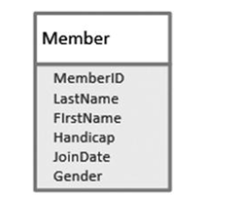
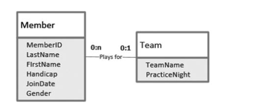
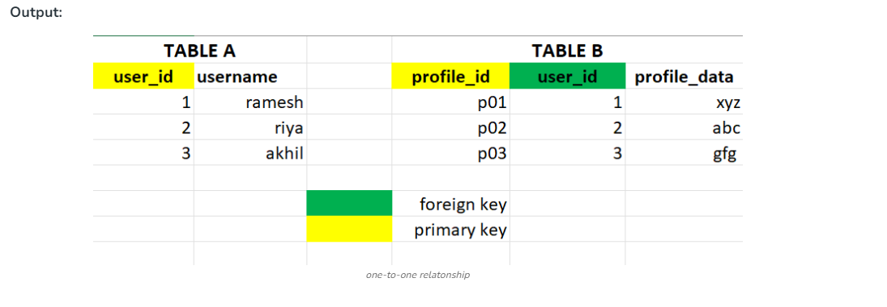
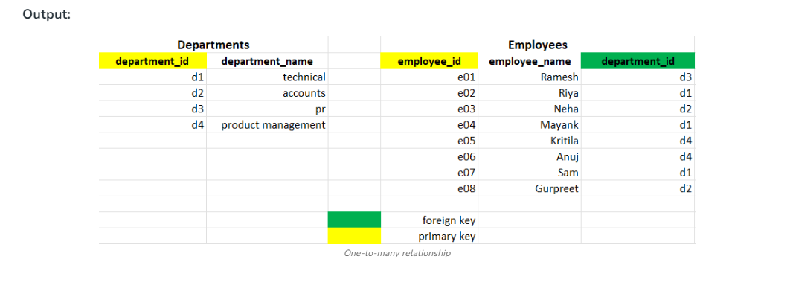
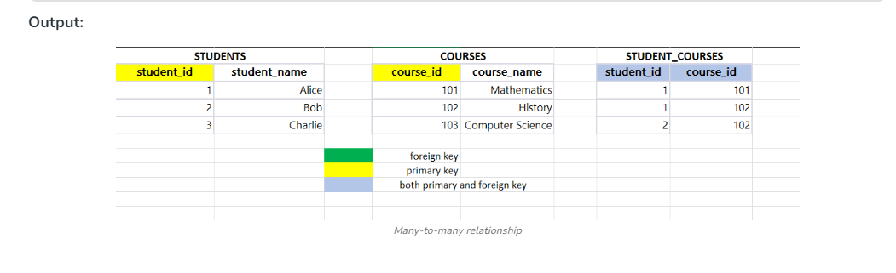
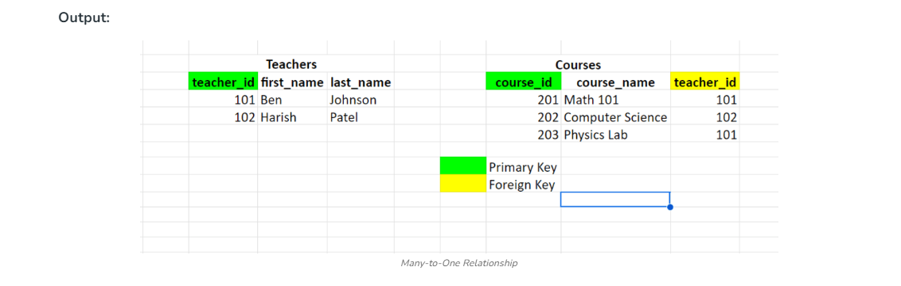
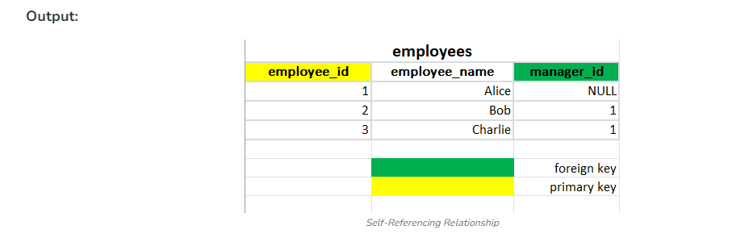

# UML Diagrams

## Single class (table)

## Related classes (tables)

# Relationships

## One to one

- Each record in Table A is associated with one and only one record in Table B, and vice versa
- Includes a foreign key in one of the tables that references the primary key of another table

## One to many

- Each record in Table A can be associated with multiple records in Table B, but each record in Table B is associated with only one record in Table A
- Include a foreign key in the many side table (Table B) that references the primary key of the 'one' side table (Table A)
- Example: Tables departments and employees, where each department can have multiple employees, but each employee belongs to one department

# Many to many

- Each record in Table A can be associated with multiple records in Table B, and vice versa
- Create an intermediate table, (also known as a junction or linking table) that contains foreign keys referencing both related tables
- Example: Tables student and courses, where each student can enroll in multiple courses, and each course can have multiple students

## Many to one

- Multiple records in Table B can be associated with one record in Table A
- Create a Foreign Key in "Many Table" that references to primary key in "One Table"
- Example: Table teachers and courses, many courses can be taught by single teacher

## Self-referencing

- A table has a foreign key that references its primary key
- Include a foreign key column in the same table that references its primary key
- Example: A table employees with a column manager_id referencing the same table's employee_id

