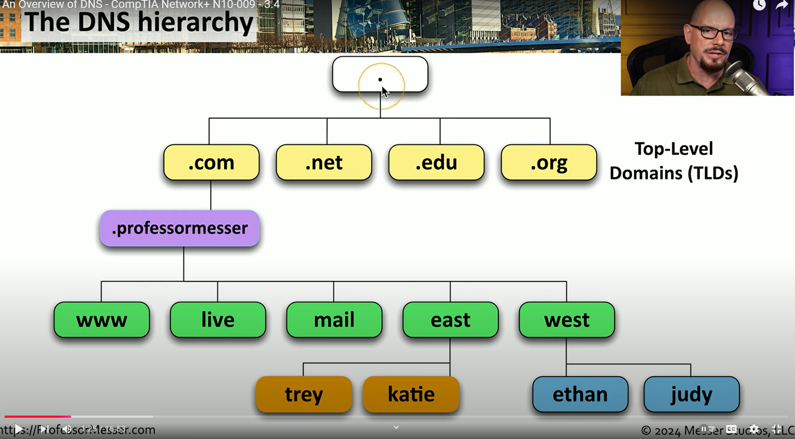

# DNS

DNS (Domain Name System) translates human-readable domain names into IP addresses that computers use to identify each other on a network

This allows easy use for the standard user and that they don't need to remember the IP address of a website for instance when trying to navigate. DNS is fundamental to the internet and also services like Microsoft Active Directory and Entra ID.

