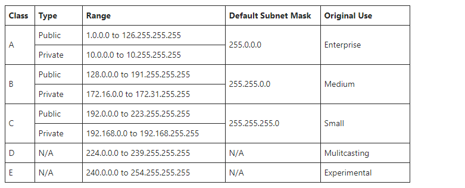

# IPv4 Further Addressing

- If IPv4 is 32 bits, that 2 to the power 32 is 4,294,967,296 possible addresses. With 8 billion people in the world, how does that work?
- You use 192.168.0 at home, but everyone does

## Public versus private IPv4 addresses

In the world of IPv4 addressing a distinction is made between Public and Private Addresses
ie only certain address ranges are used priately. This private address isn't used past our internal subnets ie they are not valid past our routers. When we leave our home setup to go out onto the internet our ISP allocates us a different IPv4 address - a public one.

## IPv4 Classes

On local private networks you use either Class A, B or C private ranges

When you leave the scope of your private range, you are assigned a Public Address by your ISP. 

We officially ran out of public IPv4 addresses in November 2019. This is why IPv6 in a public sense.