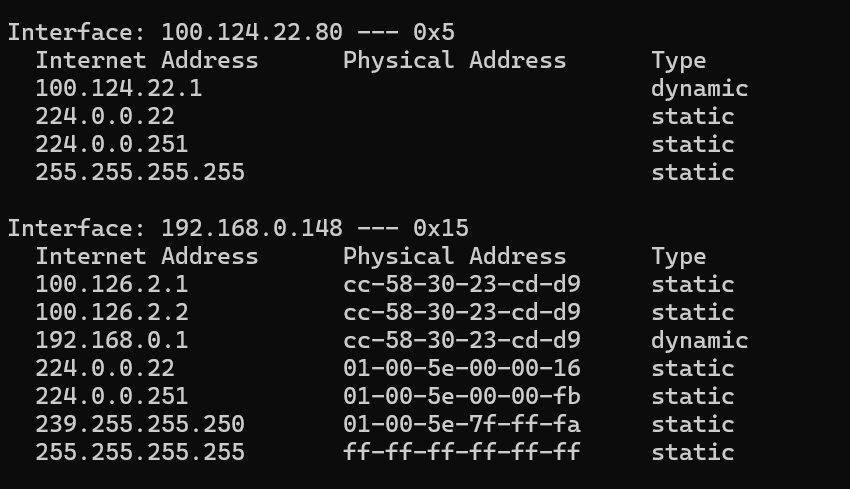

# Layer 2

The key element here is the MAC Address. The Media Access Control address is a 48bit hexadecimal number allocated to each network card/ interface. This is known as the physical address eg A8-93-4A-2F-73-01.

The key question is why do we need an IP Address and a MAC address?

Some of this is historical, a time before IP address, but in essence Layer 2 is concerned about getting from a to b, while Layer 3 (IP Address) is about where we want to go to overall.

Example: IP address is like a postal address, but getting the latter from A to B (layer 2) means deciding on the way to get there. I could walk directly or take the letter to the post office, who would in turn send it there. Both the house and the post office in this scenario have a MAC address. Computers used ARP (Address Resolution Protocol) to achieve this. It is a simple table where MAC and IP address are associated with eachother. Can be seen on Windows Command Prompt with:

`arp -a`

The reason for this table is we generally start with an IP address. From there we go to layer 2 and work out the MAC addres. If there are two machines with a cable between, the a broadcast is made saying 'who has this MAC address?'. Once a rely is received, it then updates the ARP table (ie who replied and what was their IP). If there is more than one device, it's the same process, but we are introduced to the primary Layer 2 device called a switch.

## Switch

Successor to the hub. A switch creates an ARP table, but this time it associates MAC addresses to ports. In essence the switch learns which device is connected to it and only sends the relevant traffic ie matching MAC address to the correct port. Switches don't interact with IP address.