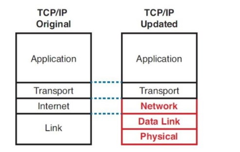
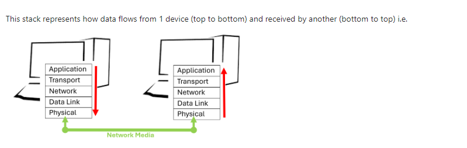

# Network Models and Devices

## Networking models

TCP/IP stands for Transmission Control Protocol / Internet Protocol

- TCP is the language (protocol) that modern networks use (not the only one)
- IP is the addressing scheme

In the same way that the English language is used in the post

## TCP/IP 

Here is the old and the updated version of the tcp/ip model

This stack represents how data flows from 1 device (top to bottom) and received by another (bottom to top) ie

In essence data is "packaged" at each of these stages before it leaves the device. The "layers" break down as follows:

- Layer 5 - Application - The most intelligent layer
The actual application eg Outlook - sending an email

- Layer 4 - Transport
The protocol to send the data - this can include if there is error checking. TCP is the most used, but another is UDP.

- Layer 3 - Network
The address - consider this like your own address

- Layer 2 - Data Link
How do I get from A to B, MAC addresses etc

- Layer 1 - Physical - the most simple layer
The media on which the data travels eg the network card to a wired connection or wirelessly via a wireless card

## OSI Model 

Open Systems Interconnection reference model is another model commonly used to explain the networking process. It predates the TCP/IP model and describes in further detail some of the processes involved. The noticeable difference is that Layers 5,6 and 7 of the OSI model are merged into 1 layer in the TCP/IP model (application - Layer 5)

Layer 1 - Physical - physical signals from one part of the network to another
Layer 2 - Data Link Layer - Basic network language, foundation of communication - referred to as the MAC (Media Access Control) address of the hardware card
Layer 3 - Routing Layer - IP Addresses, Router, Packet - Fragment frames into multiple pieces 
Layer 4 - Transport Layer - The "Post Office" layer - TCP (Transmission Control Protocol) protocol and UDP (User Datagram Protocol)
Layer 5 - Session layer - Communication management between point A and point B - start, stop, restart
Layer 6 - Presentation - Character encoding - often combined with the application layer
Layer 7 - Application - The layer we see - HTTP, FTP, DNS, POP3

## As a conversation 

Application: https://mail.google.com
Presentation: SSL encryption
Session: Link the presentation to the transport
Transport: TCP encapsulation
Network: IP encapsulation
Data Link: Ethernet
Physical: Electrical signals
