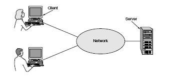
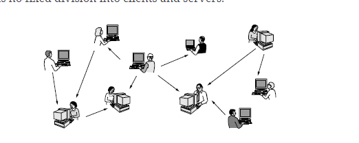

# Introduction to Networking

## Definition of Computer Network

Collection of autonomous computers interconnected by a single technology. Two computers are said to be interconnected if they are able to exchange information. The connection could be via fiber optics, microwaves, infrared, and communication satellites.

## Difference between a Computer Network and a Distributed System

A distributed System is a collection of independent computers that appears to the users as a single coherent system.A well known example of a distributed system is the World Wide Web, which sits upon the Internet and presents a model in which everything looks like a document (Web page).

In effect, a distributed system is a software system built on top of a network. 

## VPN definition

Virtual Private Network 

## Client Server Model

Under most conditions, one server can handle a large number (hundreds or thousands) of clients simultaneously.

Communication between the client process sending a message over a network to the server process. The client process then waits for a reply message. When the server process gets the request, it performs the requested work or looks up the requested data and sends back a reply.

## Peer to peer communication

In this form, individuals who form a loose group can communicate with others in the group. Every person can, in principle, communicate with one or more other people; there is no fixed division into clients and servers. Often used to share music and videos. Email is also peer to peer.

